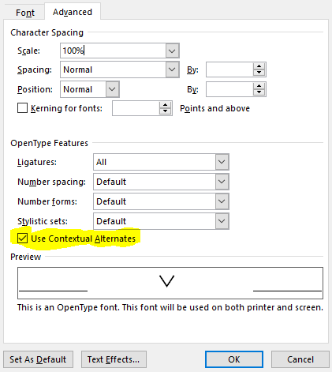

# linja pona

*sitelen pona* is a script for *toki pona*.

The hieroglyphs were created by Sonja Lang, the creator of toki pona.
They appear in [Toki Pona: The Language of Good](https://tokipona.org/).

I have created a font called *linja pona*, it means “simple line”.
With linja pona, I wanted to create a standard font that was simple and that could be read easily at different sizes.

--- [jan Same](https://musilili.net/linja-pona/)

## Version 4.2

This version uses OpenType features to dynamically compose compound glyphs, rather than relying on including precomposed glyphs in the font. 
As a result, it allows [over 6,000 new compound glyphs](https://davidar.github.io/linja-pona/nimi) ([screenshot](images/nimi.png)) to be used.   
It also has better webfont support.   
This version of the font was made by David A Roberts.

## Usage

To use *compound glyphs*, put a *hyphen* or a *plus sign* between two words,  
e.g.: *toki-pona*, *linja+pona*

To use *cartouches*, use square brackets and underscores before each glyph,  
e.g.: *ma [_kasi_alasa_nasin_awen_telo_aa] li suli*

To use a *long pi*, put a *hyphen* or a *plus sign* after a *pi*.   
The more *hyphens* or *plus signs* you input, the longer the pi will be. The maximum length is 3 *hyphens* or *plus signs*.  
e.g.: *toki pi- ma-pona, toki pi-- ma pona, toki pi+++ ma pona suli*

### HTML

```html
<head>
<link rel="stylesheet" href="https://davidar.github.io/linja-pona/stylesheet.css">
</head>
<body class="linja-pona">
...
```

### MS Word

First enable ligatures and then check this box in font settings (Right click > Font.... > Advanced tab):



### MacOS

1. Download the desired OTF file
2. Open the "Font Book" application
3. Select "File" > "Add Font" and select the downloaded OTF file
